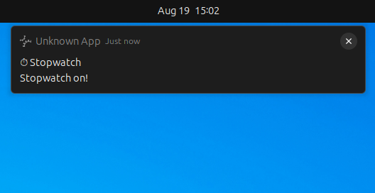
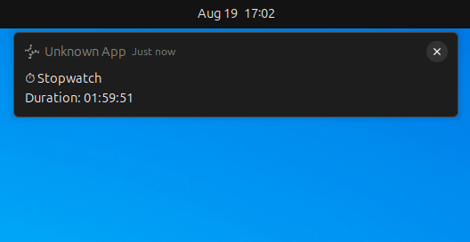
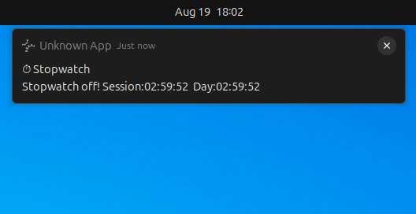
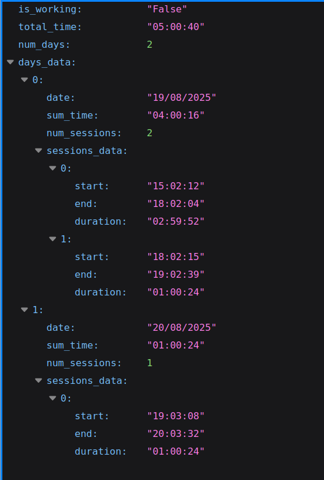

---

### Stopwatch

---

This application is designed to track working (or study) time. It helps you monitor how much time you spend on tasks in a simple and convenient way.

**How it works:**

* When you press the assigned hotkeys (for example, `Ctrl + Shift + S`), the app records the start time of a session.
* When you press the same hotkeys again, it records the end time of the session. The duration is calculated as the difference between start and end.
* By pressing another hotkey (for example, `Ctrl + Shift + D`), you can check the current session duration without stopping it.
* All results are saved into a JSON file.

---

### Installation and Running

1. Clone the repository:

```
git clone https://github.com/A7exG0/stopwatch
```

2. Install dependencies:

```
pip install plyer
```

3. In the `path.txt` file, specify the path to the JSON file where the results will be stored (e.g. `D:\sessions.json`).

---

### Setting up Hotkeys in Ubuntu

1. Go to **Settings → Keyboard → View and Customize Shortcuts → Custom Shortcuts**.
2. Add your own key combination.
3. In the **Command** field, enter:

```
python3 /{path_to_file}/main.py
```

This will start/stop the stopwatch.

4. To add another hotkey for checking the current session duration, enter:

```
python3 /{path_to_file}/main.py duration
```

---

### Setting up Hotkeys in Windows (via Shortcut)

1. On the Desktop: **Right click → New → Shortcut**.
2. In the **Type the location of the item** field, enter:

```
py "C:\path\to\main.py"
```

(replace with the full path to your `main.py`)

3. Name the shortcut and click **Finish**.
4. Right-click the shortcut → **Properties → Shortcut** tab.
5. In the **Shortcut key** field, press your desired key combination (e.g., `Ctrl+Alt+M`).
6. Optionally, create another shortcut with the `duration` argument to check session time:

```
py "C:\path\to\main.py" duration
```

Screenshots of working app: 

Turning on:


Checking duration: 


Turning off: 


Json file:
